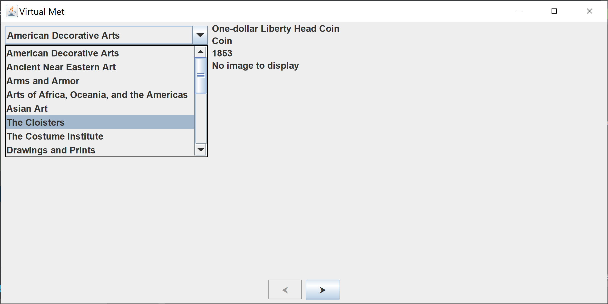
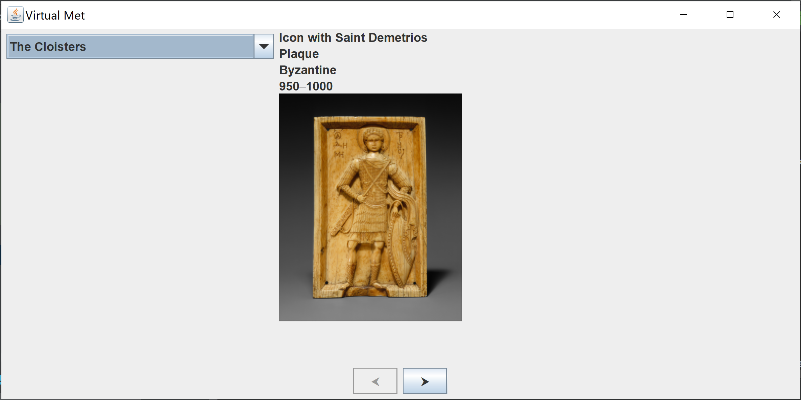
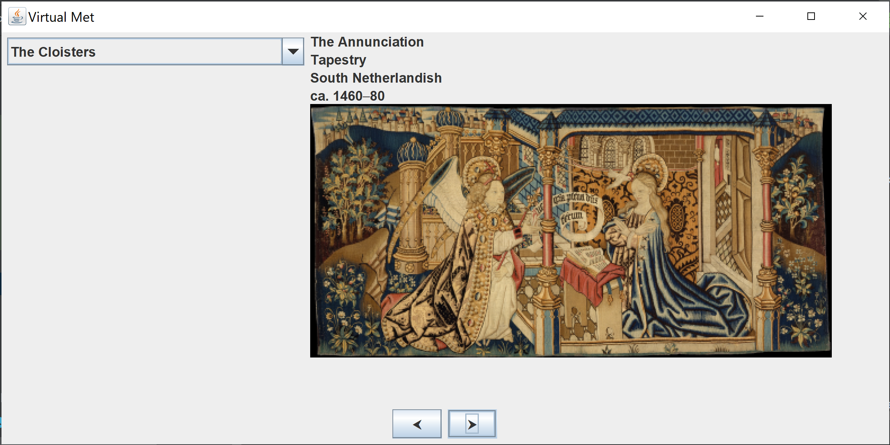

# METROPOLITAN MUSEUM OF ART API Display

In this project I have created a display of the art and history contained in the met using the [Met API](https://metmuseum.github.io "Met API Documentation").
One simply chooses a department and can view the several artifacts contained in it.

The application displays the following when available:

* Artifact Title
* Artifact Name
* Artifact Culture
* Artifact Date
* Artifact Period
* Image of artifact

